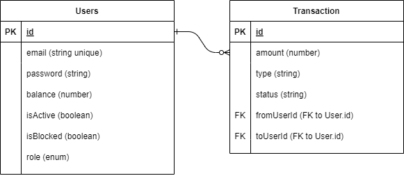

# Setup Instructions

## Prerequisites

- Docker
- Docker Compose

## Running the Application

1. **Clone the repository**

   ```bash
   git clone https://github.com/cyberberry/secure-pay.git
   cd secure-pay

2. **Build and start the containers**

   ```bash
   docker-compose up --build

3. **Access the Application**

- The NestJS application will be accessible at http://localhost:3000.
- PostgreSQL will be available at localhost:5432.

4. **Stopping the Containers**

   ```bash
    docker-compose down


# Database Pre-Seeding

- The database will be pre-seeded with the following users upon application startup to streamline the setup process:

    **Admin User:**
    
    Email: admin@example.com

    Password: admin

    Balance: 100

    Role: ADMIN

    Active: true

    Blocked: false
    
    **Inactive Client User:**
    
    Email: client_inactive@example.com

    Password: client

    Balance: 100

    Role: CLIENT
    
    Active: false

    Blocked: false
    
    **Active Client User:**
    
    Email: client_active@example.com

    Password: client

    Balance: 100

    Role: CLIENT
    
    Active: true
    
    Blocked: false

These users will be available in the database when the application is first started.

# Webhook URL

https://webhook.site/26bd6e37-b6cf-48ad-b1d8-55d3fad6139a

# ERD Diagram


